# 数据科学(Data Science)

> 本仓库的代码全部在 Anaconda 的 [jupyter NoteBook](http://nbviewer.jupyter.org) 中编写

> 数据科学工作流
> 1. Inquire：通过数据获取什么信息，解决什么问题
> 2. Obtain：数据如何获取（[Python](https://www.python.org/)）
> 3. Scrub：数据的清理、整理和分析（[pandas](https://pandas.pydata.org)、[NumPy](http://www.numpy.org)）
> 4. Explore：展示数据、数据可视化（[MatPlotLib](https://matplotlib.org)、[Seaborn](http://seaborn.pydata.org/#)）
> 5. Model：通过数据分析和机器学习对数据进行进一步分析和训练（[SciKit-learn](http://scikit-learn.org/)、[SciPy](https://www.scipy.org)、[TensorFlow](https://tensorflow.google.cn)）
> 6. iNterpret：最终结果展示（[BOKEH](https://bokeh.pydata.org/en/latest/)、[D3.js](https://d3js.org)）

# 目录（Contents）

* [1. 环境搭建](#1-环境搭建)
* [2. NumPy 入门](#2-numpy-入门)
    * [2.1 NumPy 中创建数组及访问数组的元素](#21-numpy-中创建数组及访问数组的元素)
        * [2.1.1 创建数组](#211-创建数组)
        * [2.1.2 访问数组元素](#212-访问数组元素)
        * [2.1.3 创建矩阵](#213-创建矩阵)
    * [2.2 数组和矩阵运算](#22-数组和矩阵运算)
        * [2.2.1 数组的运算](#221-数组的运算)
        * [2.2.2 矩阵的运算](#222-矩阵的运算)
    * [2.3 Array 的 input 和 output](#23-array-的-input-和-output)
        * [2.3.1 使用 pickle 序列化 numpy array](#231-使用-pickle-序列化-numpy-array)
        * [2.3.2 使用 numpy 序列化 numpy array](#232-使用-numpy-序列化-numpy-array)
* [3. pandas 入门](#3-pandas-入门)
    * [3.1 pandas 中的 Series](#31-pandas-中的-series)
        * [3.1.1 创建 Series](#311-创建-series)
        * [3.1.2 Series 操作](#312-series-操作)
    * [3.2 pandas 中的 DataFrame](#32-pandas-中的-dataframe)
        * [3.2.1 创建 DataFrame](#321-创建-dataframe)
        * [3.2.2 DataFrame 操作](#322-dataframe-操作)
    * [3.3 深入理解 Series 和 DataFrame](#33-深入理解-series-和-dataframe)
    * [3.4 DataFrame IO](#34-dataframe-io)
    * [3.5 DataFrame(Selecting 和 Indexing)](#35-dataframeselecting-和-indexing)
    * [3.6 Reindexing Series 和 DataFrame](#36-reindexing-series-和-dataframe)
    * [3.7 Mapping 和 Replace](#37-mapping-和-replace)
    * [3.8 NaN - Not a Number](#38-nan---not-a-number)
    * [3.9 多级 index](#39-多级-index)
* [4. pandas 玩转数据](#4-pandas-玩转数据)
    * [4.1 Series 和 DataFrame 的简单数学运算](#41-series-和-dataframe-的简单数学运算)
        * [4.1.1 Series 的数学运算](#411-series-的数学运算)
        * [4.1.2 DataFrame 的数学运算](#412-dataframe-的数学运算)
    * [4.2 Series 和 DataFrame 的排序](#42-series-和-dataframe-的排序)
    * [4.3 重命名 DataFrame 的 index](#43-重命名-dataframe-的-index)
    * [4.4 DataFrame 的 merge 操作](#44-dataframe-的-merge-操作)
    * [4.5 Concatenate 和 Combine](#45-concatenate-和-combine)
        * [4.5.1 Concatenate](#451-concatenate)
        * [4.5.2 Concat](#452-concat)
        * [4.5.3 Combine](#453-combine)
    * [4.6 时间序列的操作基础](#46-时间序列的操作基础)
    * [4.7 其他方法](#47-其他方法)
        * [4.7.1 数据处理](#471-数据处理)
        * [4.7.2 数据清洗](#472-数据清洗)
* [5. 绘图与可视化-MatPlotLib](#5-绘图与可视化-matplotlib)
    * [5.1 MatPlotLib-线性图](#51-matplotlib-线性图)
    * [5.2 MatPlotLib-直方图](#52-matplotlib-直方图)
    * [5.3 MatPlotLib-密度图](#53-matplotlib-密度图)
    * [5.4 pandas 的 Series 绘图](#54-pandas-的-series-绘图)
    * [5.5 pandas 的 DataFrame 绘图](#55-pandas-的-dataframe-绘图)
* [6. 绘图与可视化-SeaBorn](#6-绘图与可视化-seaborn)
    * [6.1 Seaborn-直方图和密度图](#61-seaborn-直方图和密度图)
    * [6.2 Seaborn-柱状图和热力图](#62-seaborn-柱状图和热力图)
    * [6.3 Seaborn-设置图形显示的效果](#63-seaborn-设置图形显示的效果)
    * [6.4 Seaborn-强大的调色功能](#64-seaborn-强大的调色功能)
* [7. 数据分析项目实战](#7-数据分析项目实战)

---

* [附录](#附录)
    * [1. 数据可续领域5个组建 Python 库](#1-数据科学领域5个组建-python-库)
    * [2. 数学基础-矩阵运算](#2-数学基础-矩阵运算)
    * [3. 工具使用 Jupyter Notebook](#3-工具使用-jupyter-notebook)

---

## 1. 环境搭建

各种平台使用 [Anaconda](https://www.anaconda.com/download/#macos) 搭建数据分析开发环境

环境搭建可参考 	
Timothy老师的 [搭建开发环境，跨平台原理](http://sa.mentorx.net/course/54/task/321/show)

## 2. NumPy 入门

高效的数据结构 Array（数组）介绍，是学习其他高级数据结构的基础

[NumPy Docs](https://docs.scipy.org/doc/numpy/user/quickstart.html)

### 2.1 NumPy 中创建数组及访问数组的元素

[NumPy 中创建数组及访问数组的元素](Code/1-NumPy/NumPy中创建数组及访问数组的元素.ipynb)  

#### 2.1.1 创建数组

```python
import numpy as np

# 创建一维数组
# 通过 python list 创建
list_1 = [1, 2, 3, 4] # [1, 2, 3, 4]
array_1 = np.array(list_1) # array([1, 2, 3, 4])

# 创建二维数组
list_2 = [5, 6, 7, 8]
array_2 = np.array([list_1, list_2])
# array([[1, 2, 3, 4],
#      [5, 6, 7, 8]])

# array_1 是一个一维数组
# array_2 是一个二维数组

# 其他创建数组的方法
# 快速创建一个 1-10（不含10）的数组，间隔默认为1
array_4 = np.arange(1, 10) # array([1, 2, 3, 4, 5, 6, 7, 8, 9])

# 参数依次为：起始值（包含），结束值（不包含），间隔
array_4 = np.arange(1, 10, 2) # array([1, 3, 5, 7, 9])

# 快速创建数组
# 创建一个随机元素的 10 位一维数组（元素符合正态分布）
np.random.randn(10)

# 返回一个 10 以内的 int 型 随机数
np.random.randint(10)

# 返回一个 10 以内的 int 型 2 乘 3 的二维数组
np.random.randint(10, size=(2, 3))

# 返回一个 10 以内的 int 型 20 位的一维数组
np.random.randint(10, size=20)

# 将一个 10 以内的 int 型 20 位的一维数组，转换为一个 4 乘 5 的二维数组
np.random.randint(10, size=20).reshape(4, 5)
```

#### 2.1.2 访问数组元素

```python
import numpy as np


# 获取数组属性

# array_2
# array([[1, 2, 3, 4],
#      [5, 6, 7, 8]])

# 获取元祖
array_2.shape # (2, 4) 表示为一个 2 行 4 列的数组

# 获取数组中元素的个数
array_2.size # 8

# 返回数组中元素的数据类型
# 当数组中元素的数据类型不一致时会返回范围最广的那个
array_2.dtype # dtype('int64')

# a
# array([1, 2, 3, 4, 5, 6, 7, 8, 9])

# a 的第 0 位
a[0] # 1

# a 的 第 1 位到第 4 位
a[1:5] # array([2, 3, 4, 5])

# b
# array([[1, 2, 3],
#        [4, 5, 6]])

# b 的第 1 行第 0 个元素
b[1][0] # 4

# b 的第 1 行第 0 个元素
b[1, 0] # 4 等同于 b[1][0]

# c
# array([[1, 2, 3],
#        [4, 5, 6],
#        [7, 8, 9]])

# 取 c 的第 0、1 行第 1、2 列
c[:2 ,1:]
# array([[2, 3],
#        [5, 6]])

# c
# array([[1, 2, 2, 6, 8],
#        [0, 4, 4, 6, 8],
#        [7, 8, 1, 0, 8],
#        [7, 2, 4, 0, 5]])

# 返回 c 中 唯一的（不重复）的值
np.unique(c) # array([0, 1, 2, 4, 5, 6, 7, 8])

# 求和，多维数组所有列的和
sum(c) # array([15, 16, 11, 12, 29])

# 求和，多维数组第 0 行的和
sum(c[0]) # 19

# 求和，多维数组第 0 列的和
sum(c[:, 0]) # 15

# 数组中的最大值
c.max() # 8
```

#### 2.1.3 创建矩阵

```python
import numpy as np

# 创建特殊矩阵

# 创建一维全0矩阵，5 为位数
np.zeros(5) # array([0., 0., 0., 0., 0.])

# 创建二维矩阵全0矩阵
np.zeros([2, 3]) 
# array([[0., 0., 0.],
#        [0., 0., 0.]])

# 创建单位矩阵 5 乘 5
np.eye(5) 
# array([[1., 0., 0., 0., 0.],
#        [0., 1., 0., 0., 0.],
#        [0., 0., 1., 0., 0.],
#        [0., 0., 0., 1., 0.],
#        [0., 0., 0., 0., 1.]])

# 创建矩阵

# np.mat([[1, 2, 3], [4, 5, 6]])
# matrix([[1, 2, 3],
#         [4, 5, 6]])

# 将数组 a 转换成矩阵（数组可转换为矩阵）
np.mat(a)
```

### 2.2 数组和矩阵运算

[数组和矩阵运算](Code/1-NumPy/数组和矩阵运算.ipynb)

#### 2.2.1 数组的运算

```python
import numpy as np

# 数组的运算

# a
# array([[6, 5, 5, 8, 4],
#        [8, 4, 6, 8, 1],
#        [5, 7, 1, 5, 8],
#        [0, 5, 4, 1, 2]])
# b
# array([[3, 8, 8, 2, 6],
#        [8, 1, 2, 5, 1],
#        [4, 4, 3, 1, 7],
#        [4, 8, 4, 1, 3]])

# 数组的加法
# 对应元素的和
a + b
# array([[ 9, 13, 13, 10, 10],
#        [16,  5,  8, 13,  2],
#        [ 9, 11,  4,  6, 15],
#        [ 4, 13,  8,  2,  5]])

# 数组的减法
# 对应元素的差
a - b
# array([[ 3, -3, -3,  6, -2],
#        [ 0,  3,  4,  3,  0],
#        [ 1,  3, -2,  4,  1],
#        [-4, -3,  0,  0, -1]])

# 数组的乘法
# 对应元素的积
a * b
# array([[18, 40, 40, 16, 24],
#        [64,  4, 12, 40,  1],
#        [20, 28,  3,  5, 56],
#        [ 0, 40, 16,  1,  6]])

# 数组的除法
# 对应元素的商（当除数为 0 时，会有警告，结果以 inf 表示）
a / b
# array([[2.        , 0.625     , 0.625     , 4.        , 0.66666667],
#        [1.        , 4.        , 3.        , 1.6       , 1.        ],
#        [1.25      , 1.75      , 0.33333333, 5.        , 1.14285714],
#        [0.        , 0.625     , 1.        , 1.        , 0.66666667]])
```

#### 2.2.2 矩阵的运算

```python
import numpy as np

# 矩阵的运算

# A
# matrix([[6, 5, 5, 8, 4],
#         [8, 4, 6, 8, 1],
#         [5, 7, 1, 5, 8],
#         [0, 5, 4, 1, 2]])
# B
# matrix([[3, 8, 8, 2, 6],
#         [8, 1, 2, 5, 1],
#         [4, 4, 3, 1, 7],
#         [4, 8, 4, 1, 3]])

# 矩阵的加法
# 矩阵的加法为对应元素的和
A + B
# matrix([[ 9, 13, 13, 10, 10],
#         [16,  5,  8, 13,  2],
#         [ 9, 11,  4,  6, 15],
#         [ 4, 13,  8,  2,  5]])

# 矩阵的减法
# 矩阵的减法为对应元素的差
A - B
# matrix([[ 3, -3, -3,  6, -2],
#         [ 0,  3,  4,  3,  0],
#         [ 1,  3, -2,  4,  1],
#         [-4, -3,  0,  0, -1]])

# 矩阵的乘法
# 会报错
A * B

--------
A = np.mat(np.random.randint(10, size=20).reshape(4, 5))
# A （A 为 4 乘 5 的矩阵）
# matrix([[9, 0, 3, 8, 6],
#         [4, 0, 7, 1, 8],
#         [4, 7, 2, 2, 7],
#         [2, 4, 2, 1, 5]])
B = np.mat(np.random.randint(10, size=20).reshape(5, 4))
# B （B 为 5 乘 4 的矩阵）
# matrix([[2, 0, 7, 0],
#         [4, 7, 3, 6],
#         [9, 9, 0, 9],
#         [7, 4, 9, 3],
#         [2, 1, 4, 4]])

# 4 乘 5 的矩阵与 5 乘 4 的矩阵的积为一个 4 乘 4 的矩阵 
A * B
# matrix([[113,  65, 159,  75],
#         [ 94,  75,  69,  98],
#         [ 82,  82,  95,  94],
#         [ 55,  55,  55,  65]])


```

### 2.3 Array 的 input 和 output

[Array 的 input 和 output](Code/1-NumPy/Array的input和output.ipynb)

#### 2.3.1 使用 pickle 序列化 numpy array

```python
import pickle
import numpy as np

# 查看当前目录的文件
!ls

# 使用 pickle 序列化 numpy array
# x
# array([0, 1, 2, 3, 4, 5, 6, 7, 8, 9])

# 使用 pickle 序列化
f = open('x.pki', 'wb') # 写二进制文件
pickle.dump(x, f)

f = open('x.pki', 'rb') # 读二进制文件
pickle.load(f)

```

#### 2.3.2 使用 numpy 序列化 numpy array

```python
import numpy as np

# 使用 numpy 序列化 numpy array
np.save('one_array', x) # 写二进制文件
np.load('one_array.npy') # 读二进制文件

# 同时序列化多个数组
np.savez('two_array.npz', a=x, b=y) # x、y 均为数组，a、b 分别为 x、y 的别名

# 读多个序列化数组的文件
c = np.load('two_array.npz')
c['a'] # 读 a
c['b'] # 读 b
```

## 3. pandas 入门

[pandas API](https://pandas.pydata.org/pandas-docs/stable/api.html#)  
pandas 中两种重要的数据结构：[Series](https://pandas.pydata.org/pandas-docs/stable/generated/pandas.Series.html#pandas.Series) 和 [DataFrame](https://pandas.pydata.org/pandas-docs/stable/generated/pandas.DataFrame.html#pandas.DataFrame)  
此处可参考我的另一个库：[PandasVersusExcel(Python)](https://chanmenglin.github.io/PandasVersusExcel/) | [Github](https://github.com/ChanMenglin/PandasVersusExcel)

### 3.1 pandas 中的 Series

[pandas 中的 Series](Code/2-pandas/pandas中的Series.ipynb)

#### 3.1.1 创建 Series

```python
import numpy as np
import pandas as pd

# 创建 Series
# 通过 list 创建
s1 = pd.Series([1, 2, 3, 4])
s1
# 0    1
# 1    2
# 2    3
# 3    4
# dtype: int64

# 通过 NumPy 的 Array 创建
s2 = pd.Series(np.arange(3))
s2
# 0    0
# 1    1
# 2    2
# dtype: int64

# 通过 字典 创建
s3 = pd.Series({'1': 1, '2': 2, '3': 3})
s3
# 1    1
# 2    2
# 3    3
# dtype: int64

# 通过其他 Series 创建，当新的 Series 比原先的长时，多出的值为 NaN
index_1 = ['A', 'B', 'C', 'D', 'E']
s5 = pd.Series(s4, index=index_1)
# s5
# A    1.0
# B    2.0
# C    3.0
# D    4.0
# E    NaN
# dtype: float64
```

#### 3.1.2 Series 操作

```python
import numpy as np
import pandas as pd

# Series 操作

# s1
# 0    1
# 1    2
# 2    3
# 3    4
# dtype: int64

# 查看 Series 的数据（数据为 array）
s1.values # array([1, 2, 3, 4])

# 查案 Series 的索引
s1.index # RangeIndex(start=0, stop=4, step=1)

# 指定 Series 的 index
s4 = pd.Series([1, 2, 3, 4], index=['A', 'B', 'C', 'D'])
s4
# A    1
# B    2
# C    3
# D    4
# dtype: int64

# 获取 s4 中索引为 A 的元素
s4['A'] # 1

# 获取 s4 中元素的值大于 2 的数据
s4[s4>2]
# C    3
# D    4
# dtype: int64

# 将 Series 转换为 字典
s4.to_dict() # {'A': 1, 'B': 2, 'C': 3, 'D': 4}

--------------------
# s5
# A    1.0
# B    2.0
# C    3.0
# D    4.0
# E    NaN
# dtype: float64

# 判断空值
pd.isnull(s5)
# A    False
# B    False
# C    False
# D    False
# E     True
# dtype: bool

# 判断非空值
pd.notnull(s5)
# A     True
# B     True
# C     True
# D     True
# E    False
# dtype: bool

# 为 Series 添加名称
s5.name = 'demo'

# 为 Series 的 index 添加名称
s5.index.name = 'demo index'
s5.index # Index(['A', 'B', 'C', 'D', 'E'], dtype='object', name='demo index')
```

### 3.2 pandas 中的 DataFrame

[pandas 中的 DataFrame](Code/2-pandas/pandas中的DataFrame.ipynb)


#### 3.2.1 创建 DataFrame

```python
import numpy as np
import pandas as pd
from pandas import Series, DataFrame

# 创建 DataFrame

# 通过 webbrowser 打开一个网页
import webbrowser
link = 'https://www.tiobe.com/tiobe-index/'
webbrowser.open(link) # 打开一个网页

# 通过 粘贴板 导入
# 先复制一个表格（此处为 https://www.tiobe.com/tiobe-index/ 中的编程语言排行榜）
df = pd.read_clipboard() # 读取粘贴板并解析，再转换为一个 DataFrame （此处一定要先复制表格后执行）
df
'''
    Dec 2018	Dec 2017	Change	Programming Language	Ratings	Change.1
0	1	        1	 NaN	    Java	        15.932%	+2.66%
1	2	        2	 NaN	    C	                14.282%	+4.12%
2	3	        4	change	    Python	        8.376%	+4.60%
3	4	        3	change	    C++	                7.562%	+2.84%
4	5	        7	change	    Visual Basic .NET	7.127%	+4.66%
'''

# 查看 df 的数据类型
type(df) # pandas.core.frame.DataFrame
```

#### 3.2.2 DataFrame 操作

```python
import numpy as np
import pandas as pd
from pandas import Series, DataFrame

# DataFrame 操作

# df
'''
    Dec 2018	Dec 2017	Change	Programming Language	Ratings	Change.1
0	1	    1	        NaN	    Java	        15.932%	+2.66%
1	2	    2	        NaN	    C	                14.282%	+4.12%
2	3	    4	        change	    Python	        8.376%	+4.60%
3	4	    3	        change	    C++	                7.562%	+2.84%
4	5	    7	        change	    Visual Basic .NET	7.127%	+4.66%
'''

# 读取 DataFrame 的列名
df.columns
'''
Index(['Dec 2018', 'Dec 2017', 'Change', 'Programming Language', 'Ratings',
       'Change.1'],
      dtype='object')
'''

# 获取莫一列的值
df.Ratings # 列名
'''
0    15.932%
1    14.282%
2     8.376%
3     7.562%
4     7.127%
Name: Ratings, dtype: object
'''

# 获取莫一列的值
df['Programming Language']
'''
0                 Java
1                    C
2               Python
3                  C++
4    Visual Basic .NET
Name: Programming Language, dtype: object
'''

# 放回的类型为 Series
type(df['Programming Language']) # pandas.core.series.Series

# 数据过滤
df_new = pd.DataFrame(df, columns=[ 'Programming Language', 'Dec 2018' ] )
df_new
'''

    Programming Language	Dec 2018
0	Java	                    1
1	C	                    2
2	Python	                    3
3	C++	                    4
4	Visual Basic .NET	    5
'''

# 当通过之前的 DataFrame 生成新的 DataFrame 且有一列在 原 DataFrame 不存在时（此处为 'Dec 2019'）
df_new = pd.DataFrame(df, columns=[ 'Programming Language', 'Dec 2018', 'Dec 2019' ] )
df_new
'''
	Programming Language	Dec 2018	Dec 2019
0	    Java	            1	        NaN
1	    C	                    2	        NaN
2	    Python	            3	        NaN
3	    C++	                    4	        NaN
4	    Visual Basic .NET	    5	        NaN
'''

# 修改 DataFrame 列的值 方法一 通过 list 修改
df_new['Dec 2019'] = range(0, 5)

# 修改 DataFrame 列的值 方法二 通过 array 修改
df_new['Dec 2019'] = np.arange(0, 5)

# 修改 DataFrame 列的值 方法三 通过 Sreies 修改
df_new['Dec 2019'] = pd.Series(np.arange(0, 5))
df_new
# 方法一、方法二、方法三的结果均相同
'''
	Programming Language	Dec 2018	Dec 2019
0	    Java	            1	            0
1	    C	                    2	            1
2	    Python	            3	            2
3	    C++	                    4	            3
4	    Visual Basic .NET	    5	            4
'''

# 修改 DataFrame 列的指定行值 方法四 通过 Sreies 指定 index 修改(为指定的行默认为 NaN)
df_new['Dec 2019'] = pd.Series([100, 200], index=[1, 2])
df_new
'''
	Programming Language	Dec 2018	Dec 2019
0	        Java	            1	        NaN
1	        C	            2	        100.0
2	        Python	            3	        200.0
3	        C++	            4	        NaN
4	        Visual Basic .NET   5	        NaN

'''
```

### 3.3 深入理解 Series 和 DataFrame

[深入理解 Series 和 DataFrame](Code/2-pandas/深入理解Series和DataFrame.ipynb)

```python
import numpy as np
import pandas as pd

# 深入理解 Series 和 DataFrame

# 定义基础数据，后面的实例均基于此基础数据
data = {'Country': ['Belgium', 'India', 'Brazil'], 
       'Capital': ['Brussels', 'New Delhi', 'Brasilia'], 
       'Population': [11190846, 1303171035, 207847528]}

# Series
# 通过字典创建 Series
s1 = pd.Series(data['Country'], index=['A', 'B', 'C'])
# s1
# A    Belgium
# B      India
# C     Brazil
# dtype: object

s1.values # array(['Belgium', 'India', 'Brazil'], dtype=object)
s1.index # Index(['A', 'B', 'C'], dtype='object')

# DataFrame
# 通过字典创建 DataFrame
df1 = pd.DataFrame(data)
'''
df1
        Country	    Capital	Population
0	Belgium	    Brussels	11190846
1	India	    New Delhi	1303171035
2	Brazil	    Brasilia	207847528
'''

df1['Country']
# 0    Belgium
# 1      India
# 2     Brazil
# Name: Country, dtype: object

type(df1['Country']) #  pandas.core.series.Series

df1.iterrows() # <generator object DataFrame.iterrows at 0x11e5db258>

for row in df1.iterrows():
    print('行：'), print(row), 
    print('行的类型：'), print(type(row)), 
    print('行的长度：'), print(len(row)), 
    print('行的第一部分：'), print(row[0]),  
    print('行的第二部分：'), print(row[1]), 
    print('行的第一部分的类型：'), print(type(row[0])),  
    print('行的第二部分的类型：'), print(type(row[1]))
    break
'''
行：
(0, Country        Belgium
Capital       Brussels
Population    11190846
Name: 0, dtype: object)
行的类型：
<class 'tuple'>
行的长度：
2
行的第一部分：
0
行的第二部分：
Country        Belgium
Capital       Brussels
Population    11190846
Name: 0, dtype: object
行的第一部分的类型：
<class 'int'>
行的第二部分的类型：
<class 'pandas.core.series.Series'>
'''
# 从上面的结果可以看出 DataFrame 的行由 Series 组成，因此可以使用 Series 创建 DataFrame
s1 = pd.Series(data['Capital'])
s2 = pd.Series(data['Country'])
s3 = pd.Series(data['Population'])
df_new = pd.DataFrame([s1, s2, s3], index=['Capital', 'Country', 'Population'])
df_new
'''
            0               1	        2
Capital	    Brussels	New Delhi	Brasilia
Country	    Belgium     India	        Brazil
Population  11190846	1303171035	207847528
'''

# 行列转换
df_new = df_new.T
df_new
‘’‘
        Capital	        Country	Population
0	Brussels	Belgium	11190846
1	New Delhi	India	1303171035
2	Brasilia	Brazil	207847528
’‘’
```

### 3.4 DataFrame IO

[官方文档](http://pandas.pydata.org/pandas-docs/stable/io.html)  
[PandasVersusExcel(Python)](https://chanmenglin.github.io/PandasVersusExcel/) 中  

* [2 - 读取文件](https://github.com/ChanMenglin/PandasVersusExcel/blob/master/2-ReadExcel/ReadExcel.py)  
* [22 - 读取CSV、TSV、TXT文件中的数据](https://github.com/ChanMenglin/PandasVersusExcel/blob/master/22-ReadData/ReadData.py)


### 3.5 DataFrame(Selecting 和 Indexing)

[官方文档](http://pandas.pydata.org/pandas-docs/stable/indexing.html)  
[PandasVersusExcel(Python)](https://chanmenglin.github.io/PandasVersusExcel/) 中  

* [3 - 行、列、单元格](https://github.com/ChanMenglin/PandasVersusExcel/blob/master/3-Rows&Clumns&Cell/Rows&Clumns&Cell.py)
* [4&5 - 数据区域的读取，填充整数、文字,填充日期序列](https://github.com/ChanMenglin/PandasVersusExcel/blob/master/4%265-ReadData&BaseInput/ReadData&BaseInput.py)
* [27 - 行操作集锦](https://github.com/ChanMenglin/PandasVersusExcel/blob/master/27-RowOperation/RowOperation.py)
* [28 - 列操作集锦](https://github.com/ChanMenglin/PandasVersusExcel/blob/master/28-ColOperation/ColOperation.py)

### 3.6 Reindexing Series 和 DataFrame

[Reindexing Series&DataFrame](Code/2-pandas/ReindexingSeriesDataFrame.ipynb)  

```python
import numpy as np
import pandas as pd

# Reindexing Series and DataFrame

# Series reindex

s1 = pd.Series([1, 2, 3, 4], index=['A', 'B', 'C', 'D'])
# s1
# A    1
# B    2
# C    3
# D    4
# dtype: int64

# 按住 Shift + Tab 可以查看帮助
s1.reindex(index=['A', 'B', 'C', 'D', 'E'])
# A    1.0
# B    2.0
# C    3.0
# D    4.0
# E    NaN
# dtype: float64

s1.reindex(index=['A', 'B', 'C', 'D', 'E'], fill_value=10)
# A     1
# B     2
# C     3
# D     4
# E    10
# dtype: int64

s2 = pd.Series(['A', 'B', 'C'], index=[1, 3, 5])
# s2
# 1    A
# 3    B
# 5    C
# dtype: object

s2.reindex(index=range(7))
# 0    NaN
# 1      A
# 2    NaN
# 3      B
# 4    NaN
# 5      C
# 6    NaN
# dtype: object

# method='ffill' 表示根据已有的值自动填充为 NaN 的值
s2.reindex(index=range(7), method='ffill')
# 0    NaN
# 1      A
# 2      A
# 3      B
# 4      B
# 5      C
# 6      C
# dtype: object

# DataFrame reindex

df1 = pd.DataFrame(np.random.rand(25).reshape([5, 5]), index=['A', 'B', 'D', 'E', 'F'], columns=['c1', 'c2', 'c3', 'c4', 'c5'])
df1
'''
        c1	        c2	        c3	        c4	        c5
A	0.919411	0.238651	0.088673	0.830227	0.284514
B	0.334756	0.652239	0.913840	0.053076	0.375364
D	0.811720	0.760921	0.860246	0.727191	0.009915
E	0.282364	0.246554	0.743932	0.445262	0.339246
F	0.438870	0.930862	0.817973	0.861525	0.550942
'''

df1.reindex(index=[['A', 'B', 'C', 'D', 'E']], columns=['c1', 'c2', 'c3', 'c4', 'c5', 'c6'])
'''
        c1	c2	c3	c4	c5	c6
A	NaN	NaN	NaN	NaN	NaN	NaN
B	NaN	NaN	NaN	NaN	NaN	NaN
C	NaN	NaN	NaN	NaN	NaN	NaN
D	NaN	NaN	NaN	NaN	NaN	NaN
E	NaN	NaN	NaN	NaN	NaN	NaN
'''

s1.reindex(index=['C', 'D'])
# C    3
# D    4
# dtype: int64

df1.reindex(index=['A', 'B'])
'''
        c1	        c2	        c3	        c4	        c5
A	0.352591	0.437914	0.131892	0.273035	0.463063
B	0.367352	0.245098	0.081478	0.744348	0.990410
'''

s1.drop('A')
# B    2
# C    3
# D    4
# dtype: int64

# axis 表示行和列
# 0 表示行
# 1 表示列
df1.drop('A', axis=0)
'''
        c1	        c2	        c3	        c4	        c5
B	0.367352	0.245098	0.081478	0.744348	0.990410
D	0.364244	0.751367	0.782257	0.443011	0.688876
E	0.615851	0.725409	0.741932	0.791803	0.576622
F	0.599175	0.543432	0.443125	0.471929	0.436654
'''
```

### 3.7 Mapping 和 Replace

[Mapping&Replace](Code/2-pandas/MappingReplace.ipynb)  

```python
import numpy as np
import pandas as pd

# Mapping
df1 = pd.DataFrame({'城市': ['北京', '上海', '广州'], '人口': [1000, 2000, 1500]}, index=['A', 'B', 'C'])
# df1
'''
        城市	人口
A	北京	1000
B	上海	2000
C	广州	1500
'''

df1['GDP'] = pd.Series([1000, 2000, 1500])
df1
'''
	城市	人口	GDP
A	北京	1000	NaN
B	上海	2000	NaN
C	广州	1500	NaN
'''

gdp_map = {'北京': 1100, '上海': 2100, '广州': 1600}
df1['GDP'] = df1['城市'].map(gdp_map)
df1
'''
        城市	人口	GDP
A	北京	1000	1100
B	上海	2000	2100
C	广州	1500	1600
'''

df1['GDP'] = pd.Series([1000, 2000, 1500], index=['A', 'B', 'C'])
df1
'''
        城市	人口	GDP
A	北京	1000	1000
B	上海	2000	2000
C	广州	1500	1500
'''

s1 = pd.Series(np.arange(5))
# s1
# 0    0
# 1    1
# 2    2
# 3    3
# 4    4
# dtype: int64

s1.replace(1, np.nan)
# 0    0.0
# 1    NaN
# 2    2.0
# 3    3.0
# 4    4.0
# dtype: float64

s1.replace([1, 2, 3], [10, 20, 30])
# 0     0
# 1    10
# 2    20
# 3    30
# 4     4
# dtype: int64
```

### 3.8 NaN - Not a Number

[Not a Number](Code/2-pandas/NaN.ipynb)  

```python
import numpy as np
import pandas as pd

# NaN - Not a Number

n = np.nan
type(n) # float

# 任何数值（整数、浮点数、0）与 NaN 作运算结果都是 NaN
m = 1
m + n # nan

# NaN in Series
s1 = pd.Series([1, 2, np.nan, 3, 4], index=['A', 'B', 'C', 'D', 'E'])
# s1
# A    1.0
# B    2.0
# C    NaN
# D    3.0
# E    4.0
# dtype: float64

# 判断 Series 中的值是否是 NaN
s1.isnull()
# A    False
# B    False
# C     True
# D    False
# E    False
# dtype: bool

# 判断 Series 中的值是否不是 NaN
s1.notnull()
# A     True
# B     True
# C    False
# D     True
# E     True
# dtype: bool

# 删除 Series 中的值是 NaN 的数据
s1.dropna()
# A    1.0
# B    2.0
# D    3.0
# E    4.0
# dtype: float64

# Nan in DataFrame
df1 = pd.DataFrame([[1, 2, 3], [np.nan, 5, 6], [7, np.nan, 9], [np.nan, np.nan, np.nan]])
df1
'''
        0	1	2
0	1.0	2.0	3.0
1	NaN	5.0	6.0
2	7.0	NaN	9.0
3	NaN	NaN	NaN
'''

df1.isnull()
'''
        0	1	2
0	False	False	False
1	True	False	False
2	False	True	False
3	True	True	True
'''

df1.notnull()
'''
        0	1	2
0	True	True	True
1	False	True	True
2	True	False	True
3	False	False	False
'''

df1.dropna(axis=0)
'''
        0	1	2
0	1.0	2.0	3.0
'''

df1.dropna(axis=1)
'''
0
1
2
3
'''

df1.dropna(how='all')
'''
        0	1	2
0	1.0	2.0	3.0
1	NaN	5.0	6.0
2	7.0	NaN	9.0
'''

df2 = pd.DataFrame([[np.nan, 5, 6], [7, np.nan, np.nan], [np.nan, np.nan, np.nan]])
# df2
'''
        0	1	2
0	NaN	5.0	6.0
1	7.0	NaN	NaN
2	NaN	NaN	NaN
'''

# thresh 表示范围 删除少于 2 个非 NaN 值的行或列
df2.dropna(thresh=2)
'''
        0	1	2
0	NaN	5.0	6.0
'''

# 替换值为 NaN 的值
df2.fillna(value=1)
'''
        0	1	2
0	1.0	5.0	6.0
1	7.0	1.0	1.0
2	1.0	1.0	1.0
'''

# 按列替换值为 NaN 的值
df2.fillna(value={0:0, 1:1, 2:2})
'''
        0	1	2
0	0.0	5.0	6.0
1	7.0	1.0	2.0
2	0.0	1.0	2.0
'''
```

### 3.9 多级 index

[多级 index](Code/2-pandas/多级index.ipynb)  

```python
import numpy as np
import pandas as pd

# 多级 index

# 创建一个两级的 Series
s1 = pd.Series(np.random.randn(6), index=[[1, 1, 1, 2, 2, 2], ['a', 'b', 'c', 'a', 'b', 'c']])
s1
# 1  a   -0.610026
#    b    1.649775
#    c    0.835034
# 2  a    0.899401
#    b   -0.685298
#    c   -1.846341
# dtype: float64

s1[1]
# a   -0.610026
# b    1.649775
# c    0.835034
# dtype: float64

s1[1]['a'] # -0.6100255133809527

s1[:, 'a']
# 1    1.042715
# 2    1.460387
# dtype: float64

# 多级 Series 转换为 Da taFrame
df1 = s1.unstack()
# df1
'''
        a	        b	        c
1	-0.610026	1.649775	0.835034
2	0.899401	-0.685298	-1.846341

'''

df2 = pd.DataFrame([s1[1], s1[2]])
# df2
'''
        a	        b	        c
0	-0.610026	1.649775	0.835034
1	0.899401	-0.685298	-1.846341
'''

# DataFrame 转换为多级 Series
s2 = df1.T.unstack()
# s2
# 1  a   -0.610026
#    b    1.649775
#    c    0.835034
# 2  a    0.899401
#    b   -0.685298
#    c   -1.846341
# dtype: float64

# 创建多级 index 的 Da taFrame
df = pd.DataFrame(np.arange(16).reshape(4, 4), index=[['a', 'a', 'b', 'b'], [1, 2, 1, 2]], columns=[['bj', 'bj', 'sh', 'gz'], [8, 9, 8, 8]])
# df
'''
        bj	        sh	        gz
        8	9	8	8
a	1	0	1	2	3
        2	4	5	6	7
b	1	8	9	10	11
        2	12	13	14	15
'''

df['bj']
'''
                8	9
a	1	0	1
        2	4	5
b	1	8	9
        2	12	13
'''

df['bj'][8]
# a  1     0
#    2     4
# b  1     8
#    2    12
```

## 4. pandas 玩转数据

pandas 进阶，学习数据清洗、排序、采样技术、封箱技术、Group By、聚合技术、透视表等

### 4.1 Series 和 DataFrame 的简单数学运算

[Series 和 DataFrame 的简单数学运算](Code/3-pandas玩转数据/1-Series和DataFrame的简单数学运算.ipynb) 

#### 4.1.1 Series 的[数学运算](http://pandas.pydata.org/pandas-docs/stable/api.html#computations-descriptive-stats)

Series 的运算为对应 index 的值的运算的集合

```python
import numpy as np
import pandas as pd

s1 = pd.Series([1, 2, 3], index=['A', 'B', 'C'])
s2 = pd.Series([4, 5, 6, 7], index=['B','C', 'D', 'E'])

# Series 的运算为对应 index 的值的运算的集合
s1 + s2
# A    NaN
# B    6.0
# C    8.0
# D    NaN
# E    NaN
# dtype: float64
```

#### 4.1.2 DataFrame 的[数学运算](https://pandas.pydata.org/pandas-docs/stable/api.html#computations-descriptive-stats)

* DataFrame 的运算为对应 元素 的值的运算的集合
* [**sum()**](https://pandas.pydata.org/pandas-docs/stable/generated/pandas.DataFrame.sum.html) 计算每一列的和（NaN 会被忽略）放回一个 Series。axis=1 参数可以求每一行的值
* [**min()**](https://pandas.pydata.org/pandas-docs/stable/generated/pandas.DataFrame.min.html) 计算每一列的最小值（NaN 会被忽略）放回一个 Series，axis=1 参数可以求每一行的值
* [**max()**](https://pandas.pydata.org/pandas-docs/stable/generated/pandas.DataFrame.max.html) 计算每一列的最大值（NaN 会被忽略）放回一个 Series，axis=1 参数可以求每一行的值
* [**describe()**](https://pandas.pydata.org/pandas-docs/stable/generated/pandas.DataFrame.describe.html) 统计 

```python
df1 = pd.DataFrame(np.arange(4).reshape(2, 2), index=['A', 'B'], columns=['BJ', 'SH'])
df2 = pd.DataFrame(np.arange(9).reshape(3, 3), index=['A', 'B', 'C'], columns=['BJ', 'SH', 'GZ'])

# DataFrame 的运算为对应 元素 的值的运算的集合
df1 + df2
'''
        BJ	GZ	SH
A	0.0	NaN	2.0
B	5.0	NaN	7.0
C	NaN	NaN	NaN
'''
```

### 4.2 Series 和 DataFrame 的排序

[Series 和 DataFrame 的排序](Code/3-pandas玩转数据/2-Series和DataFrame的排序.ipynb)  

[Series Reshaping, sorting(重塑和排序)](https://pandas.pydata.org/pandas-docs/stable/api.html#reshaping-sorting)  
[DataFrame Reshaping, sorting, transposing((重塑\排序\变换))](https://pandas.pydata.org/pandas-docs/stable/api.html#reshaping-sorting-transposing)
* [**s.sort_values()**](https://pandas.pydata.org/pandas-docs/stable/generated/pandas.Series.sort_values.html) Series 按 value 升序排序（默认 ascending=True，ascending=False 表示降序排序）
* [**s.sort_index()**](https://pandas.pydata.org/pandas-docs/stable/generated/pandas.Series.sort_index.html#pandas.Series.sort_index) Series 按 index 升序排序（默认 ascending=True，ascending=False 表示降序排序）
* [**df.sort_values('A')**](https://pandas.pydata.org/pandas-docs/stable/generated/pandas.DataFrame.sort_values.html) DataFrame 以列 'A' 按 value 升序排序（默认 ascending=True，ascending=False 表示降序排序）
* [**df.sort_index()**](https://pandas.pydata.org/pandas-docs/stable/generated/pandas.DataFrame.sort_index.html) DataFrame 按 index 升序排序（默认 ascending=True，ascending=False 表示降序排序）

### 4.3 重命名 DataFrame 的 index

[重命名 DataFrame 的 index](Code/3-pandas玩转数据/3-重命名DataFrame的index.ipynb) 

```python
# 修改 DataFrame 的 index 和 columns
df.rename(index=str.lower, columns=str.lower)
df.rename(index={'BJ': 'beijing'})
df.index.map(str.upper)
```

[**map()**](http://book.pythontips.com/en/latest/map_filter.html#map) 方法
```python
# 将 list1 = [1, 2, 3, 4] 转换成 list2 = ['1', '2', '3', '4']
list1 = [1, 2, 3, 4]
# 方法一
[str(x) for x in list1] # ['1', '2', '3', '4']

# 方法二
list(map(str, list1)) # ['1', '2', '3', '4']
```

### 4.4 DataFrame 的 [merge](https://pandas.pydata.org/pandas-docs/stable/generated/pandas.DataFrame.merge.html) 操作

[DataFrame 的 merge 操作](Code/3-pandas玩转数据/4-DataFrame的merge操作.ipynb) 

```python
df1 = pd.DataFrame({'Key': ['X', 'Y', 'Z'], 'data_set_1': [1, 2, 3]})
df2 = pd.DataFrame({'Key': ['X', 'B', 'C'], 'data_set_2': [4, 5, 6]})

# 合并（类似于 SQL中的 join 操作）
pd.merge(df1, df2)
'''
Key	data_set_1	data_set_2
0	X	1	4
1	X	2	4
'''
```

### 4.5 Concatenate 和 Combine

[Concatenate 和 Combine](Code/3-pandas玩转数据/5-Concatenate和Combine.ipynb)   

NumPy [concatenate](https://docs.scipy.org/doc/numpy/reference/generated/numpy.concatenate.html)  
pandas [Merge, join, and concatenate](https://pandas.pydata.org/pandas-docs/stable/merging.html)  
pandas [concat](https://pandas.pydata.org/pandas-docs/stable/generated/pandas.concat.html#pandas.concat)  
pandas [Series.str.cat](https://pandas.pydata.org/pandas-docs/stable/generated/pandas.Series.str.cat.html#pandas.Series.str.cat)  
pandas [Series.combine_first](https://pandas.pydata.org/pandas-docs/stable/generated/pandas.Series.combine_first.html)  
pandas [DataFrame.combine_first](https://pandas.pydata.org/pandas-docs/stable/generated/pandas.DataFrame.combine_first.html#pandas-dataframe-combine-first)

#### 4.5.1 Concatenate

```python
arr1 = np.arange(9).reshape(3, 3)
arr2 = np.arange(9).reshape(3, 3)

np.concatenate([arr1, arr2])
# array([[0, 1, 2],
#        [3, 4, 5],
#        [6, 7, 8],
#        [0, 1, 2],
#        [3, 4, 5],
#        [6, 7, 8]])
```

#### 4.5.2 Concat

```python
s1 = pd.Series([1, 2, 3], index=['X', 'Y', 'Z'])
s2 = pd.Series([1, 2], index=['A', 'B'])

pd.concat([s1, s2], axis=1, sort=True)
'''
        0	1
A	NaN	1.0
B	NaN	2.0
X	1.0	NaN
Y	2.0	NaN
Z	3.0	NaN
'''

df1 = pd.DataFrame(np.random.randn(4, 3), columns=['X', 'Y', 'Z'])
df2 =  pd.DataFrame(np.random.randn(3, 3), columns=['X', 'Y', 'A'])

pd.concat([df1, df2],sort=True)
'''
        X	        Y	        Z	        X	        Y	        A
0	-0.150725	-2.251965	-0.916322	1.721364	0.310061	-0.165037
1	-1.841673	3.361009	0.132322	-1.621575	0.284105	-0.488211
2	-0.705189	-0.884906	-0.456689	1.356419	0.776563	0.920558
3	0.862066	-0.575394	0.915041	NaN	NaN	NaN
'''
```

#### 4.5.3 Combine

```python
s1 = pd.Series([2, np.nan, 4, np.nan], index=['A', 'B', 'C', 'D'])
s2 = pd.Series([1, 2, 3, 4], index=['A', 'B', 'C',  'D'])

# 使用 s2 填充 S1
s1.combine_first(s2)
# A    2.0
# B    2.0
# C    4.0
# D    4.0
# dtype: float64

df1 = pd.DataFrame({
    'x': [1, np.nan, 3, np.nan], 
    'y': [5, np.nan, 7, np.nan], 
    'z': [9, np.nan, 11, np.nan], 
})
df2 = pd.DataFrame({
    'z': [np.nan, 10, np.nan, 12], 
    'a': [1, 2, 3, 4], 
})
df1.combine_first(df2)
'''
        a	x	y	z
0	1.0	1.0	5.0	9.0
1	2.0	NaN	NaN	10.0
2	3.0	3.0	7.0	11.0
3	4.0	NaN	NaN	12.0
'''
```

### 4.6 时间序列的操作基础

[时间序列的操作基础](Code/3-pandas玩转数据/6-时间序列的操作基础.ipynb)  

[Python datetime](https://docs.python.org/2/library/datetime.html)  
[pandas datetime](https://pandas.pydata.org/pandas-docs/stable/api.html#datetimeindex)  
[pandas.to_datetime](https://pandas.pydata.org/pandas-docs/stable/generated/pandas.to_datetime.html)  
[Series datetime](https://pandas.pydata.org/pandas-docs/stable/api.html#datetimelike-properties)

```python
# 创建一个 DateTime 的对象
t1 = dt.datetime(2018, 10, 20)
t1 # datetime.datetime(2018, 10, 20, 0, 0)

date_list = [
    dt.datetime(2017, 10, 20), 
    dt.datetime(2018, 10, 21), 
    dt.datetime(2018, 11, 22), 
    dt.datetime(2018, 12, 23), 
    dt.datetime(2019, 1, 24), 
]
s1 = pd.Series(np.random.rand(5), index=date_list)
# s1
# 2017-10-20    0.467958
# 2018-10-21    0.170206
# 2018-11-22    0.349676
# 2018-12-23    0.609425
# 2019-01-24    0.543507
# dtype: float64

s1['2018-10'] 
# 2018-10-21    0.170206
# dtype: float64

d2 = pd.date_range('2018-1-1', '2018-12-30')
# d2
# DatetimeIndex(['2018-01-01', '2018-01-02', '2018-01-03', '2018-01-04',
#                '2018-01-05', '2018-01-06', '2018-01-07', '2018-01-08',
#                '2018-01-09', '2018-01-10',
#                ...
#                '2018-12-21', '2018-12-22', '2018-12-23', '2018-12-24',
#                '2018-12-25', '2018-12-26', '2018-12-27', '2018-12-28',
#                '2018-12-29', '2018-12-30'],
#               dtype='datetime64[ns]', length=364, freq='D')

s2 = pd.Series(np.random.rand(len(d2)), index=d2)
s2

s2.resample('M').mean() 
# 参考 ：https://pandas.pydata.org/pandas-docs/stable/generated/pandas.DataFrame.resample.html
```

### 4.7 其他方法

#### 4.7.1 数据处理

[Series.apply](https://pandas.pydata.org/pandas-docs/stable/generated/pandas.Series.apply.html)  
[DataFrame.apply](https://pandas.pydata.org/pandas-docs/stable/generated/pandas.DataFrame.apply.html) 

#### 4.7.2 数据清洗

[Data manipulations](https://pandas.pydata.org/pandas-docs/stable/api.html#data-manipulations)  

* 去重  
[Series.duplicated](https://pandas.pydata.org/pandas-docs/stable/generated/pandas.Series.duplicated.html)  
[Series.drop_duplicated](https://pandas.pydata.org/pandas-docs/stable/generated/pandas.Series.duplicated.html#)  
[DataFrame.duplicates](https://pandas.pydata.org/pandas-docs/stable/generated/pandas.DataFrame.duplicated.html)  
[DataFrame.drop_duplicates](https://pandas.pydata.org/pandas-docs/stable/generated/pandas.DataFrame.drop_duplicates.html)  

* 数据分箱技术  
[cut](https://pandas.pydata.org/pandas-docs/stable/generated/pandas.cut.html)  

* 数据分组技术  
[GroupBy](https://pandas.pydata.org/pandas-docs/stable/api.html#groupby)  
[Series.groupby](https://pandas.pydata.org/pandas-docs/stable/generated/pandas.Series.groupby.html)  
[DataFrame.group](https://pandas.pydata.org/pandas-docs/stable/generated/pandas.DataFrame.groupby.html)  

* 数据聚合技术  
[Series.agg](https://pandas.pydata.org/pandas-docs/stable/generated/pandas.Series.agg.html)  
[Series.aggregate](https://pandas.pydata.org/pandas-docs/stable/generated/pandas.DataFrame.aggregate.html)  
[DataFrame.agg](https://pandas.pydata.org/pandas-docs/stable/generated/pandas.DataFrame.agg.html)  
[DataFrame.aggregate](https://pandas.pydata.org/pandas-docs/stable/generated/pandas.DataFrame.aggregate.html)  

* 透视表  
[pivot_table](https://pandas.pydata.org/pandas-docs/stable/generated/pandas.pivot_table.html)  
[DataFrame.pivot_table](https://pandas.pydata.org/pandas-docs/stable/generated/pandas.DataFrame.pivot_table.html)  

## 5. 绘图与可视化-MatPlotLib

数据展示 这里只会以几种最常用的图例作为示例进行讲解，更多的图例的使用请参考[官方文档](https://matplotlib.org/gallery/index.html#)

[官网](https://matplotlib.org/index.html)  
[example](https://matplotlib.org/gallery/index.html#)  
[Matplotlib PDF](https://matplotlib.org/Matplotlib.pdf)  
[Matlotlib Tutorials](https://pythonspot.com/matplotlib/)  

此处可参考我的另一个库：[PandasVersusExcel(Python)](https://chanmenglin.github.io/PandasVersusExcel/) | [Github](https://github.com/ChanMenglin/PandasVersusExcel)

* [9 - 柱状图](https://github.com/ChanMenglin/PandasVersusExcel/blob/master/9-Histogram/Histogram.py)
* [10 - 绘制分组柱图，深度优化图表](https://github.com/ChanMenglin/PandasVersusExcel/blob/master/10-GroupedHistogran&DepthOptimizationChart/GroupedHistogran&DepthOptimizationChart.py)
* [11 - 绘制分组柱图，深度优化图表](https://github.com/ChanMenglin/PandasVersusExcel/blob/master/11-SuperimposedHistogram&HorizontalHistogram/SuperimposedHistogram&HorizontalHistogram.py)
* [12 - 绘制饼图](https://github.com/ChanMenglin/PandasVersusExcel/blob/master/12-PieChart/PieChart.py)
* [13 - 绘制折线趋势图、叠加区域图](https://github.com/ChanMenglin/PandasVersusExcel/blob/master/13-PolylineTrendChart&OverlayAreaMap/PolylineTrendChart&OverlayAreaMap.py)
* [14%15 - 散点图，直方图，密度图,密度图，数据相关性](https://github.com/ChanMenglin/PandasVersusExcel/blob/master/14%2615-ScatterPlot&Histogram&DensityMap/ScatterPlot&Histogram&DensityMap.py)

### 5.1 MatPlotLib-线性图

[MatPlotLib-线性图](Code/4-MatPlotLib/1-MatPlotLib-线性图.ipynb)  

[plot](https://matplotlib.org/api/pyplot_api.html)  

```python
import numpy as np
import matplotlib.pyplot as plt

# 线性图
a = [1, 2, 3]
b = [4, 5, 6]
plt.plot(a, b)
plt.show()
```
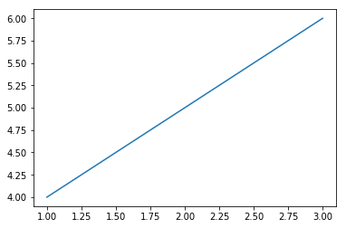  

```python
import numpy as np
import matplotlib.pyplot as plt

# 线性图
x = np.linspace(0.0, 5.0)
y1 = np.sin(np.pi*x)
y2 = np.sin(np.pi*2*x)
plt.plot(x, y1,'b--', label='sin(pi*x)')
plt.ylabel('y1 value')
plt.plot(x, y2,'r--', label='sin(pi*2x)')
plt.ylabel('y2 value')
plt.xlabel('x value')
plt.title('this is a x-y value')
plt.legend()
plt.show()
```
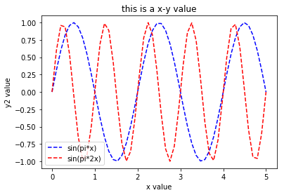  

[subplot - 子图](https://matplotlib.org/api/_as_gen/matplotlib.pyplot.subplot.html)  

```python
import numpy as np
import matplotlib.pyplot as plt

# subplot 子图
x = np.linspace(0.0, 5.0)
y1 = np.sin(np.pi*x)
y2 = np.sin(np.pi*2*x)

# 子图一（‘2, 1, 1’ 等同于‘211’ 表示 两行一列第一个图）
plt.subplot(2, 1, 1)
plt.plot(x, y1, 'b--')
plt.ylabel('y1')
plt.xlabel('x')
#（‘2, 1, 2’ 等同于‘212’表示 两行一列第二个图）
plt.subplot(212)
plt.plot(x, y2, 'r--')
plt.ylabel('y2')
plt.xlabel('x')
plt.show()
```
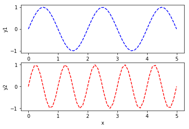  

[subplots - 子图](https://matplotlib.org/api/_as_gen/matplotlib.pyplot.subplots.html)  

```python
# 子图二（‘2, 2’ 表示两行两列）
figure, ax = plt.subplots(2, 2)
ax[0][0].plot(x, y1)
ax[0][1].plot(x, y2)
# 此处只填充了 ax[0][0]、ax[0][1]，ax[1][0]、ax[1][1] 未填充
plt.show()
```
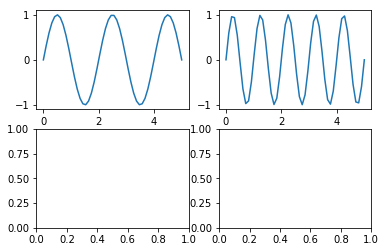  

### 5.2 MatPlotLib-直方图

[MatPlotLib-直方图](Code/4-MatPlotLib/4-MatPlotLib-直方图.ipynb)  

[hist](https://matplotlib.org/api/_as_gen/matplotlib.pyplot.hist.html)  
[Matplotlib Histogram](https://pythonspot.com/matplotlib-histogram/)  

```python
import numpy as np
import pandas as pd
import matplotlib.pyplot as plt

# MatPlotLib-直方图
s = pd.Series(np.random.randn(1000))
# 直方图（rwidth 为宽度，bins 为分割区间，默认10） 
plt.hist(s, rwidth=0.9, bins=30)
plt.show()
```
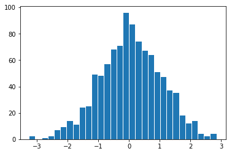  

### 5.3 MatPlotLib-密度图

[MatPlotLib-密度图](Code/4-MatPlotLib/5-MatPlotLib-密度图.ipynb)  

```python
import numpy as np
import pandas as pd
import matplotlib.pyplot as plt

# MatPlotLib-密度图
s = pd.Series(np.random.randn(1000))
# 密度图
s.plot(kind='kde')
plt.show()
```
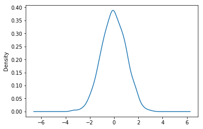  

### 5.4 pandas 的 Series 绘图

[pandas 的 Series 绘图](Code/4-MatPlotLib/2-pandas之Series绘图.ipynb)  

[Series plotting](https://pandas.pydata.org/pandas-docs/stable/api.html#plotting)  
[Series.plot](https://pandas.pydata.org/pandas-docs/stable/generated/pandas.Series.plot.html)  

```python
import numpy as np
import pandas as pd
import matplotlib.pyplot as plt

# pandas 的 Series 绘图
s1 = pd.Series(np.random.randn(1000)).cumsum()
s1.plot(kind='line', grid=True, label='s1', title='this is Series line')
plt.legend()
plt.show
```
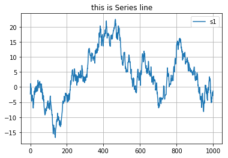  

```python
import numpy as np
import pandas as pd
import matplotlib.pyplot as plt

# pandas 的 Series 绘图
s1 = pd.Series(np.random.randn(1000)).cumsum()
s2 = pd.Series(np.random.randn(1000)).cumsum()
s1.plot(kind='line', label='s1')
s2.plot(label='s2')
plt.legend()
plt.show()
```
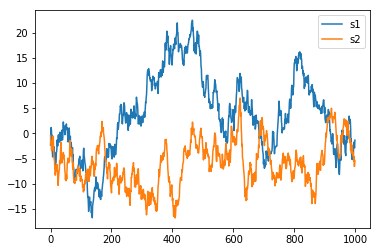  

```python
# pandas 的 Series 绘图 - 子图
s1 = pd.Series(np.random.randn(1000)).cumsum()
s2 = pd.Series(np.random.randn(1000)).cumsum()
fig, ax = plt.subplots(2, 1)
ax[0].plot(s1)
ax[1].plot(s2)
plt.show()
```
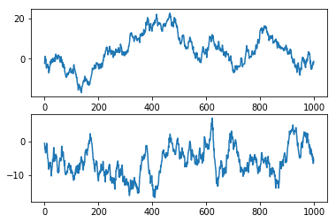  

```python
# pandas 的 Series 绘图 - 子图
s1 = pd.Series(np.random.randn(1000)).cumsum()
s2 = pd.Series(np.random.randn(1000)).cumsum()
fig, ax =plt.subplots(2, 1)
s1[0: 10].plot(ax=ax[0], kind='bar')
s2.plot(ax=ax[1])
plt.show()
```
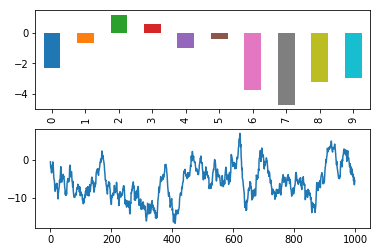  

### 5.5 pandas 的 DataFrame 绘图

[pandas 的 DataFrame 绘图](Code/4-MatPlotLib/3-pandas之DataFrame绘图.ipynb)  

[DataFrame plotting](https://pandas.pydata.org/pandas-docs/stable/api.html#api-dataframe-plotting)  
[DataFrame.plot](https://pandas.pydata.org/pandas-docs/stable/generated/pandas.DataFrame.plot.html)  

```python
import numpy as np
import pandas as pd
import matplotlib.pyplot as plt

# pandas 的 DataFrame 绘图
df = pd.DataFrame(
    np.random.randint(1, 10, 40).reshape(10, 4),
    columns=['A', 'B', 'C', 'D']
)
df.plot()
plt.show()
```
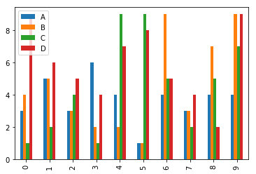  

```python
# 按行（index）画图
df.iloc[5].plot()
plt.show()
```
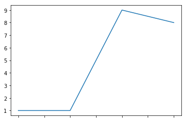  

```python
# 按行（index）画图
for i in df.index:
    df.iloc[i].plot(label=str(i))
plt.legend()
plt.show()
# 同上
df.T.plot()
plt.show()
```
  

```python
# 按列（columns）画图
for i in df.columns:
    df[i].plot(label=str(i))
plt.legend()
plt.show()
```
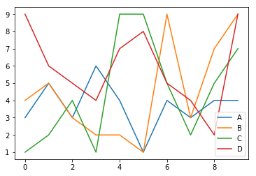  

## 6. 绘图与可视化-SeaBorn

[官网](http://seaborn.pydata.org)  
[example](http://seaborn.pydata.org/examples/index.html)  
[API](http://seaborn.pydata.org/api.html#)  
[教程](http://seaborn.pydata.org/tutorial.html#)  

### 6.1 Seaborn-直方图和密度图

[Seaborn-直方图和密度图](Code/5-Seaborn/1-Seaborn-直方图和密度图.ipynb)  

[seaborn.distplot](http://seaborn.pydata.org/generated/seaborn.distplot.html)

```python
import numpy as np
import pandas as pd
import matplotlib.pyplot as plt
import seaborn as sns

s1 = pd.Series(np.random.randn(1000))
```

```python
# pandas 直方图
plt.hist(s1)
```
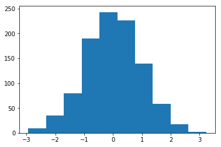  

```python
# pandas 密度图
s1.plot(kind='kde')
```
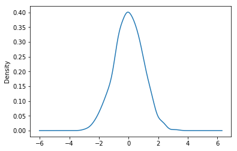  

```python
# Seaborn-直方图和密度图
sns.distplot(s1, rug=True)
```
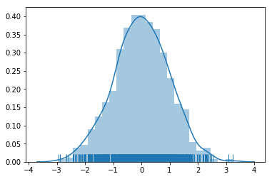  

```python
# Seaborn-密度图
sns.kdeplot(s1)
```
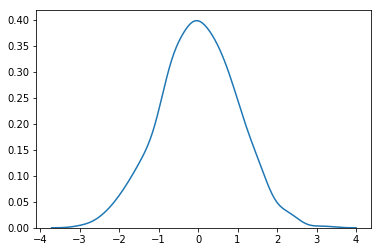  

### 6.2 Seaborn-柱状图和热力图

[Seaborn-柱状图和热力图](Code/5-Seaborn/2-Seaborn-柱状图和热力图.ipynb)  

[seaborn.heatmap](https://seaborn.pydata.org/generated/seaborn.heatmap.html)  

```python
import numpy as np
import pandas as pd
import matplotlib.pyplot as plp
import seaborn as sns

# 使用 Seaborn 生成测试数据
df1 = sns.load_dataset('flights')
df = df1.pivot(index='month', columns='year', values='passengers')
```

> [load_dataset](https://seaborn.pydata.org/generated/seaborn.load_dataset.html) 为 Seaborn 提供的测试数据的获取方法（需要网络）。  
> 数据地址：[seaborn-data](https://github.com/mwaskom/seaborn-data)

```python
# Seaborn-热力图
sns.heatmap(df)
```
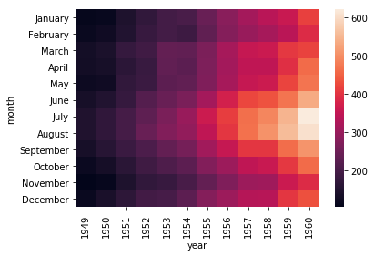  

```python
# pandas-曲线图
df.plot()
```
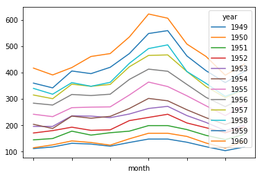  

```python
# pandas-柱状图
s.plot(kind='bar')
```
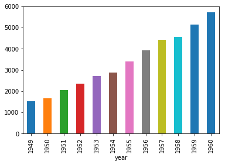  

```python
# Seaborn-柱状图
s = df.sum()
sns.barplot(x=s.index, y=s.values)
```
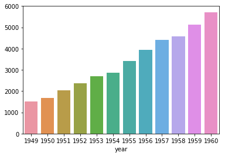  

### 6.3 Seaborn-设置图形显示的效果

[Seaborn-设置图形显示的效果](Code/5-Seaborn/3-Seaborn-设置图形显示的效果.ipynb)  

[Style control](http://seaborn.pydata.org/api.html#style-control)  
设置当前风格设置：[seaborn.set_style](http://seaborn.pydata.org/generated/seaborn.set_style.html)  
查看当前风格设置：[seaborn.axes_style](http://seaborn.pydata.org/generated/seaborn.axes_style.html#seaborn.axes_style)  
更改当前图利属性：[seaborn.set_context](http://seaborn.pydata.org/generated/seaborn.set_context.html)  
查看当前图利属性：[seaborn.plotting_context](http://seaborn.pydata.org/generated/seaborn.plotting_context.html#seaborn.plotting_context)  
取消个性化设置 [seaborn.set](http://seaborn.pydata.org/generated/seaborn.set.html)  

```python
# Seaborn 绘图风格
style = ['darkgrid', 'dark', 'white', 'whitegrid', 'ticks']
# set_style 设置当前风格设置 第二个参数可进行个性化设置
sns.set_style(style[3])
# 查看当前风格设置
sns.axes_style()

# 更改当前图利属性
context = ['paper', 'notebook', 'talk', 'poster']
sns.set_context('paper')
# 查看当前图利属性
sns.plotting_context()
```

### 6.4 Seaborn-强大的调色功能

[Seaborn-强大的调色功能](Code/5-Seaborn/4-Seaborn-强大的调色功能.ipynb)  

[Color palettes](http://seaborn.pydata.org/api.html#color-palettes)  
[Choosing color palettes](https://seaborn.pydata.org/tutorial/color_palettes.html)  
查看当前色板（RGB）：[seaborn.color_palette](https://seaborn.pydata.org/generated/seaborn.color_palette.html)  
设置当前色板（RGB）：[seaborn.set_palette](http://seaborn.pydata.org/generated/seaborn.set_palette.html)  

```python
# 查看当前色板（RGB）
sns.color_palette()

# 默认色板
pal_style = ['deep', 'muted', 'pastel', 'bright', 'dark', 'colorblind']

# 显示当前色板（RGB）
sns.palplot(sns.color_palette(pal_style[0]))
```
  

```python
# 设置色板
sns.set_palette()

# 设置临时风格(with 语句外会恢复默认色板)
with sns.color_palette('dark'):
    sinplot() # 绘图方法

# 定义自定义色板('hls' 为固定值，8 表示生成8种颜色)
sns.color_palette('hls', 8)
sns.color_palette([(0.1, 0.2, 0.3), (...)])
```

## 7. 数据分析项目实战

以股票市场为例从 数据获取-导入-分析-可视化 完整流程

---

# 附录

## 1. 数据科学领域5个组建 Python 库

[NumPy](http://www.numpy.org)  

* N维数组（矩阵）：快速高效、矢量数学运算
* 高效的 Index，不需要循环
* 开源免费，运行效率高（基于 C 语言），可媲美 [Matlab](https://ww2.mathworks.cn/products/matlab.html)

[SciPy](https://www.scipy.org)  

* 依赖于 NumPy
* 专为科学和工程设计
* 实现了多种常用科学计算：[线性代数](https://zh.wikipedia.org/wiki/%E7%BA%BF%E6%80%A7%E4%BB%A3%E6%95%B0)、[傅里叶变换](https://zh.wikipedia.org/wiki/%E5%82%85%E9%87%8C%E5%8F%B6%E5%8F%98%E6%8D%A2)、信号和图像处理

[pandas](https://pandas.pydata.org)  

* 结构化数据分析利器（依赖 NumPy）
* 提供多种高级数据结构：Time-Series(时间序列)、DataFrame、Panel
* 强大的数据索引和处理能力

[MatPlotLib](https://matplotlib.org)  

* Python 2D绘图领域使用最广泛的套件
* 基本能取代 Matlab 的绘图功能（柱形图、散点图、曲线图等）
* 通过 mplot3d 可绘制精美的3D图

[SciKit-learn](http://scikit-learn.org/)  

* 机器学习 Python 模块
* 建立在 SciPy 之上，提供了常用的机器学习算法：[聚类](https://zh.wikipedia.org/wiki/%E8%81%9A%E7%B1%BB%E5%88%86%E6%9E%90)、[回归](https://zh.wikipedia.org/wiki/%E8%BF%B4%E6%AD%B8%E5%88%86%E6%9E%90)
* 简单浴血的API接口

## 2. 数学基础-[矩阵运算](https://zh.wikipedia.org/wiki/%E7%9F%A9%E9%98%B5)

### 2.1 基本概念

* 矩阵：矩形的数组，即二维数组。其中向量和标量都是矩阵的特点
* 向量：是指 1×n 或者 n×1 的矩阵
* 标量：1×1 的矩阵
* 数组：N味的数组，是矩阵的延伸

### 2.2 特殊的矩阵

* 全0全1矩阵：矩阵中所有的元素都是0或都是1
* 单位矩阵
    * 为 n×n 的矩阵
    * 对角线上的元素都是1
    * 任何矩阵乘以单位矩阵，结果为原先的矩阵（类似于任何数乘以1）


### 2.3 矩阵的加减运算

* 相加、相减的矩阵必须要有相同的列数和行数
* 行和列对应元素相加减

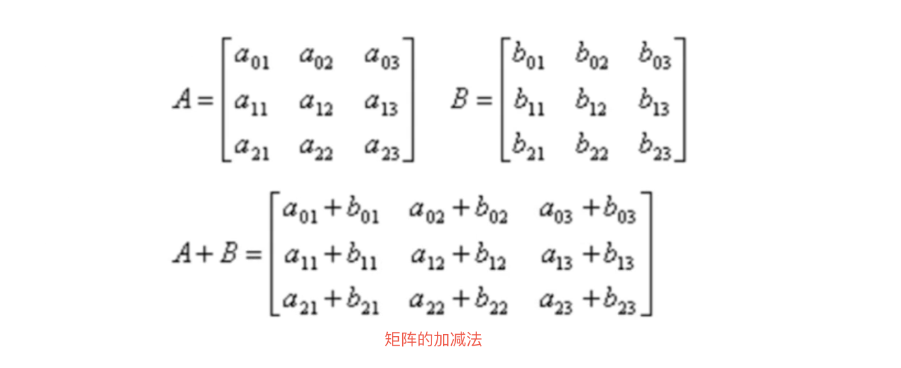

### 2.4 数组的乘法（点乘）

* 数组乘法（点乘）是对应元素之间的乘法（类似矩阵的加减法）

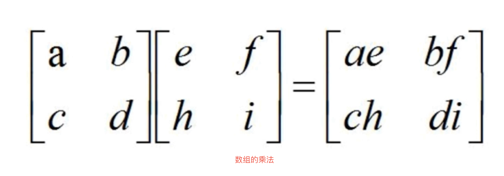

### 矩阵的乘法

* 设 A 为 m×p 的矩阵，B 为 p×m 的矩阵，m×n 矩阵 C 为 A 与 B 的乘积，记为 C=AB，其中矩阵 C 的第 i 行第 j 列元素可标示为：

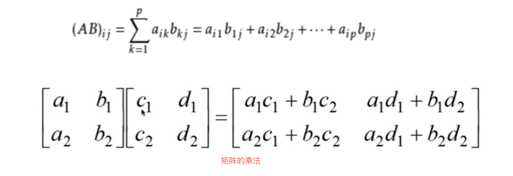

参考：清华大学出版社的线性代数 http://bs.szu.edu.cn/sljr/Up/day_110824/201108240409437707.pdf

## 3. 工具使用 Jupyter Notebook

[Jupyter 官网](https://jupyter.org)  
[Docs](https://jupyter-notebook.readthedocs.io/en/stable/)  
[nbviewer](https://nbviewer.jupyter.org)  
[Jupyter Magic functions](https://www.dummies.com/programming/python/common-jupyter-notebook-magic-functions/)  

* %matplotlib inline：matplotlib 中不用显式调用 show() 方法即可显示图形
* %timeit + 语句：可查看语句的执行时间及运行次数

